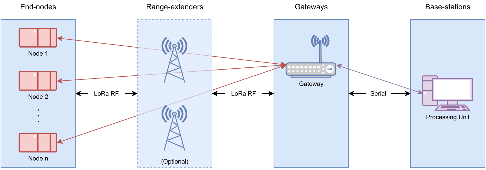

# Sensor Network

This repository holds the Sensor Network code stack for a LoRa based wireless sensor network. It contains the packages needed for deploying and monitoring a network with a gateway and node devices. 

# Introduction

The Sensor Network repository consists on a set of software that allows for a wireless sensor network to be deployed using the LoRa modulation technology. To this purpose, the repository includes Arduino packages for the node devices and gateway device.

Additionally a python application with a GUI to monitor and manage the network is included. This application is also used to connect the network to the ROS middleware so as to provide integration with vehicles like UAVs and AGVs.

The figure below depicts the network architecture used.

